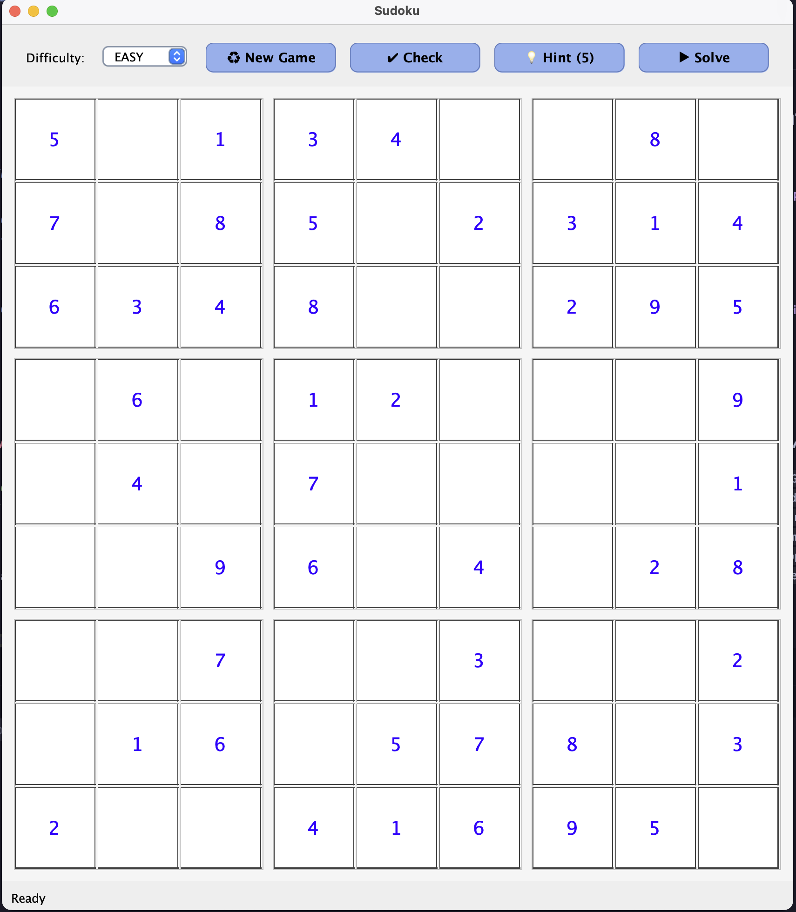
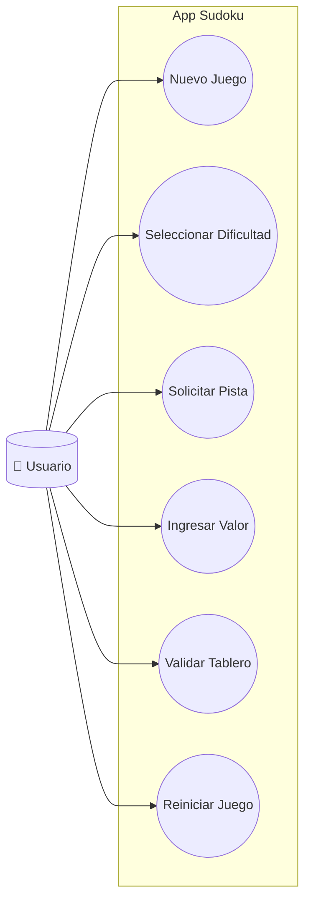
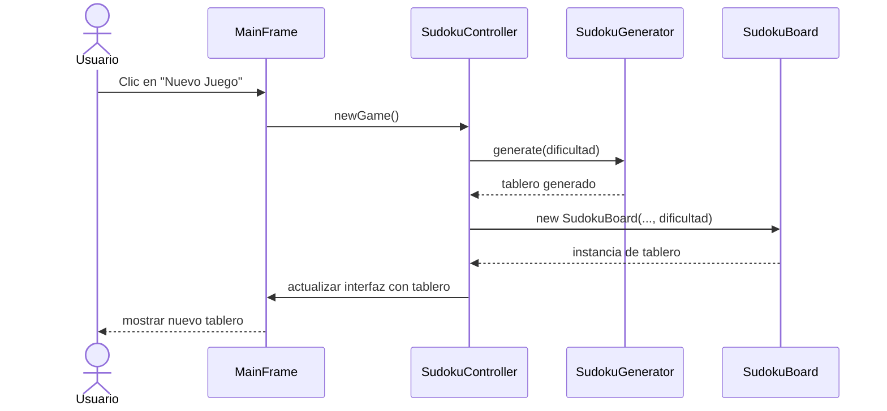
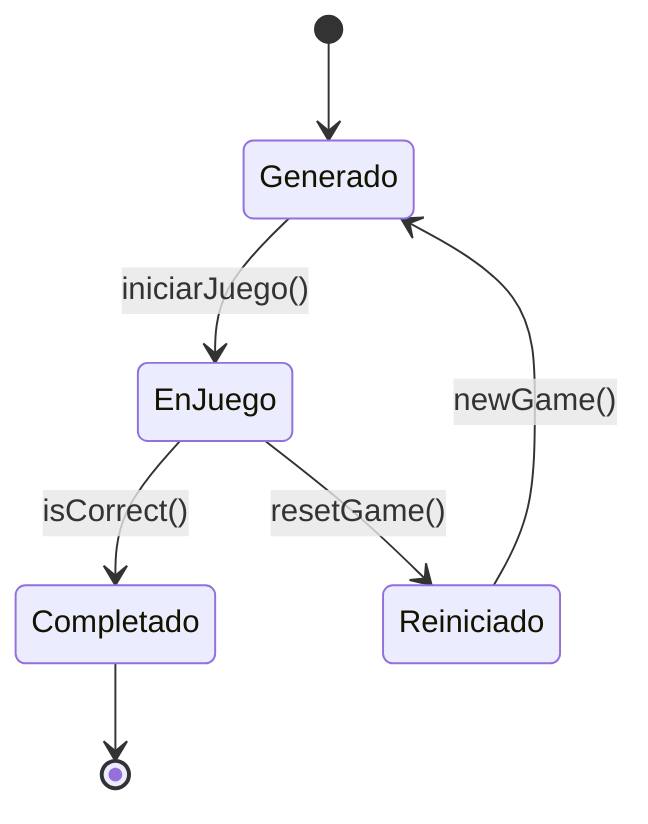
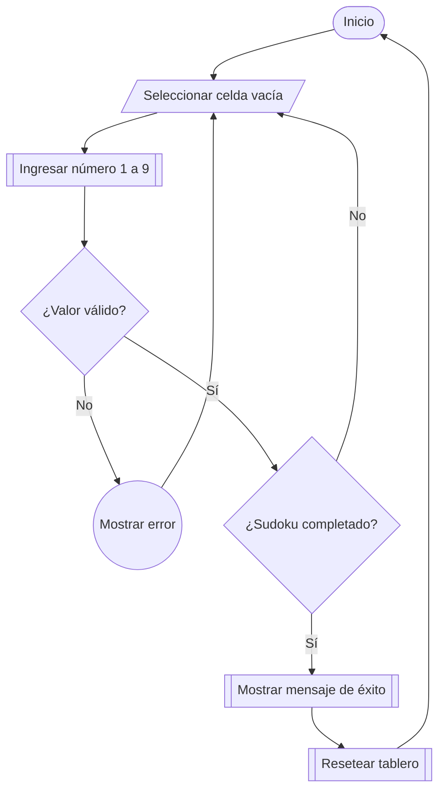

# 🧩 Proyecto Sudoku

  

---

## 📋 Tabla de Contenidos

1. [✨ Descripción](#descripción)
2. [⚙️ Tecnologías](#tecnologías)
3. [🚀 Funcionalidades Principales](#funcionalidades-principales)
4. [📦 Instalación & Uso](#instalación--uso)
5. [🎨 Interfaz de Usuario](#interfaz-de-usuario)
6. [🎯 Objetivos del Proyecto](#objetivos-del-proyecto)
7. [✅ Requisitos](#requisitos)
8. [🔄 Diagramas](#diagramas)
9. [🛠️ Desarrollo & Contribución](#desarrollo--contribución)
10. [📄 Licencia](#licencia)
11. [📞 Contacto](#contacto)

## ✨ Descripción
Aplicación de escritorio en **Java 8+ / Swing** para generar y resolver puzzles de Sudoku de forma interactiva.

- 🔍 **Generación**: `SudokuGeneratorBackTrakingImp` (algoritmo de backtracking).
- 🎛️ **Lógica de juego**: `SudokuBoard`, `DifficultyGame`.
- 🛡️ **Control**: `SudokuController`.
- 🖥️ **GUI**: Swing (`MainFrame` sobre `JFrame`, `JPanel`, `JButton`, `JComboBox`, `JTextField`).
- 🚀 **Ejecución**: `SudokuAppRunner` arranca la aplicación.
- 🧪 **Pruebas**: JUnit 5 (`*Test.java`) con cobertura ≥ 80 %.

## ⚙️ Tecnologías

- **Java 8+**
- **Swing** para la interfaz gráfica
- **JUnit 5** para tests unitarios
- **Maven/Gradle** (gestión de dependencias y compilación)

## 🚀 Funcionalidades Principales

- 🔄 **Nuevo Juego**: Genera un tablero válido según nivel.
- 🎚️ **Selección de Dificultad**: EASY (35 celdas), MEDIUM (45), HARD (55).
- 💡 **Pistas**: Revela celda correcta (máx. 5 / 3 / 2 pistas).
- ✅ **Validación en Tiempo Real**: Comprueba cada entrada (< 100 ms).
- 🔁 **Reinicio**: Mantiene solución y re-elimina celdas.
- 🎉 **Mensaje de Éxito** al completar el puzzle.

## 🎨-interfaz-de-usuario
La GUI se construye con Swing en la clase `MainFrame`. Ofrece:
- **Selección de dificultad** mediante un `JComboBox` (EASY, MEDIUM, HARD).
- **Botón “Nuevo Juego”** para generar un puzzle.
- **Botón “Pista”** que revela hasta 5, 3 o 2 números según nivel.
- **Grid 9×9** de celdas (`JTextField`) para entrada de valores.
- **Mensajes emergentes** (`JOptionPane`) para indicar éxito o error. :contentReference[oaicite:6]{index=6}:contentReference[oaicite:7]{index=7}

---

## Objetivos del Proyecto

| **ID**   | **Objetivo SMART**                                                                                 | **Tipo**      | **Métrica**                                      | **Fecha Límite** | **Responsable**      | **Estado**     |
| -------- | -------------------------------------------------------------------------------------------------- | ------------- | ------------------------------------------------ | ---------------- | -------------------- | -------------- |
| OBJ-01   | Generar tableros de Sudoku completos y válidos (9×9) sin duplicados en filas, columnas ni bloques. | Operativo     | % de tableros generados sin errores              | 2025-05-20       | Equipo de Desarrollo | Completado     |
| OBJ-02   | Implementar niveles de dificultad EASY (35 celdas), MEDIUM (45 celdas) y HARD (55 celdas).         | Táctico       | Nº de celdas removidas según el nivel de juego   | 2025-05-20       | Equipo de Desarrollo | Completado     |
| OBJ-03   | Permitir al usuario solicitar pistas limitadas (5, 3 y 2 respectivamente) según la dificultad.     | Operativo     | Nº de pistas disponibles y usadas                | 2025-05-20       | Equipo de Desarrollo | Completado     |
| OBJ-04   | Validar la solución del usuario en tiempo real en < 100 ms por entrada.                            | Táctico       | Tiempo medio de validación de celda (ms)         | 2025-06-01       | Equipo de QA         | No iniciado    |
| OBJ-05   | Alcanzar una cobertura de pruebas unitarias ≥ 80 % en las clases principales.                      | Estratégico   | % de cobertura de tests                          | 2025-05-25       | Equipo de QA         | En progreso    | :contentReference[oaicite:8]{index=8}:contentReference[oaicite:9]{index=9}

---

## Requisitos Funcionales

| **ID**  | **Descripción**                                                                                                    | **Prioridad** | **Fuente**                              | **Estado**     |
| ------- | ------------------------------------------------------------------------------------------------------------------ | ------------- | --------------------------------------- | -------------- |
| RF-01   | Generar un tablero de Sudoku válido para un nivel de dificultad dado.                                              | Alta          | Módulo de generación de tableros        | Implementado   |
| RF-02   | Eliminar el número correcto de celdas (35/45/55) según EASY, MEDIUM o HARD.                                        | Alta          | `SudokuBoard` y `DifficultyGame`        | Implementado   |
| RF-03   | Reiniciar el juego manteniendo la solución y removiendo de nuevo las celdas especificadas.                         | Media         | `resetGame()` de `SudokuBoard`          | Implementado   |
| RF-04   | Proporcionar función de pista que revele el valor correcto de una celda vacía.                                      | Media         | `SudokuController` y `MainFrame`        | Implementado   |
| RF-05   | Validar en tiempo real si el tablero actual coincide con la solución.                                               | Alta          | `isCorrect()` de `SudokuBoard`          | Implementado   |
| RF-06   | Permitir al usuario introducir números en celdas vacías y controlar accesos válidos (1–9).                          | Alta          | Interfaz `MainFrame`                    | Implementado   |
| RF-07   | Seleccionar el nivel de dificultad antes de generar un nuevo juego.                                                | Media         | Combobox `difficultyCombo`              | Implementado   |
| RF-08   | Mostrar en la interfaz el número de pistas restantes según la dificultad.                                          | Media         | Botón `hintBtn`                         | Implementado   |
| RF-09   | Mostrar mensaje de éxito al resolver correctamente el puzzle.                                                      | Baja          | Ventana emergente en `SudokuController` | Implementado   |
| RF-10   | Ejecutar todos los tests unitarios (`SudokuGeneratorBackTrakingImpTest`, `SudokuBoardTest`, `SudokuControllerTest`). | Alta          | Suite de JUnit 5                        | En progreso    | :contentReference[oaicite:10]{index=10}

---

## Requisitos No Funcionales

| **ID**   | **Descripción**                                                                            | **Categoría**    | **Métrica**                        | **Objetivo**       | **Comentarios**                            |
| -------- | ------------------------------------------------------------------------------------------ | ---------------- | ---------------------------------- | ------------------ | ------------------------------------------ |
| RNF-01   | Tiempo de generación de un tablero completo ≤ 500 ms.                                       | Rendimiento      | Tiempo medio de generación (ms)    | ≤ 500 ms           | Medido con JMH                             |
| RNF-02   | Validación de celda en tiempo real ≤ 100 ms.                                               | Rendimiento      | Latencia de validación (ms)        | ≤ 100 ms           | Pruebas automatizadas de rendimiento       |
| RNF-03   | Interfaz gráfica responsiva, carga inicial ≤ 1 s.                                          | Usabilidad       | Tiempo hasta renderizado completo  | ≤ 1 s              | Swing optimizado                           |
| RNF-04   | Compatibilidad Java 8+.                                                                   | Portabilidad     | Versión JRE soportada              | Java 8+            | Testeado en múltiples entornos             |
| RNF-05   | Cobertura de pruebas unitarias ≥ 80 %.                                                     | Calidad          | % de cobertura de código           | ≥ 80 %             | Analizado con JaCoCo                       |
| RNF-06   | Cumplir estándares de estilo (Checkstyle sin errores ni warnings).                         | Mantenibilidad   | Nº de violaciones de reglas        | 0                  | Integrado en el pipeline de CI/CD          |

---

## Diagrama de Casos de Uso

## Matriz de Trazabilidad

| **Req. ID** | **Descripción Req.**                                                               | **Objetivo(s)** | **Caso de Uso** | **Caso de Prueba**                                      |
| ----------- | --------------------------------------------------------------------------------- | --------------- | --------------- | ------------------------------------------------------- |
| RF-01       | Generar un tablero de Sudoku válido.                                              | OBJ-01          | UC1             | TP-01: `SudokuGeneratorBackTrakingImpTest`              |
| RF-02       | Eliminar el número correcto de celdas según dificultad.                           | OBJ-02          | UC2             | TP-02: `DifficultyGameTest`                             |
| RF-03       | Reiniciar el juego removiendo celdas de nuevo.                                    | OBJ-03          | UC6             | TP-03: `SudokuBoardTest`                                |
| RF-04       | Proporcionar función de pista que revele un valor correcto.                       | OBJ-03          | UC3             | TP-04: `SudokuControllerTest`                           |
| RF-05       | Validar la solución del usuario en tiempo real.                                   | OBJ-04          | UC5             | TP-05: `SudokuBoardTest`                                |

## Diagrama de Interacción (Secuencia: Nuevo Juego)

## Diagrama de Estado (Ciclo de Vida de una Partida)

## Diagrama de Actividad (Flujo: Resolver Sudoku)

---

## 🛠️ Desarrollo & Contribución

1. Haz fork del repositorio.
2. Crea una rama `feature/tu-funcionalidad`.
3. Realiza los cambios y añade tests.
4. Abre un Pull Request describiendo tu aporte.

---

## 📄 Licencia

Este proyecto está bajo la licencia **MIT**. Consulta el archivo `LICENSE` para más detalles.

---